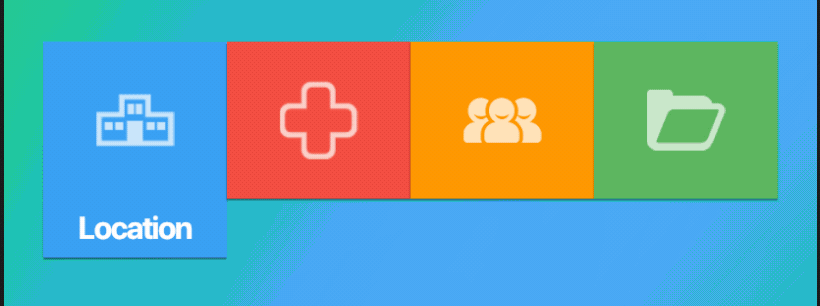

# Expandable Tabs

Expandable tabs are a fancy way to show content on Flutter.

## Usage

To use this plugin, add `expandable_tabs` as a [dependency in your pubspec.yaml file](https://flutter.io/platform-plugins/).

Basic use in the example folder.

